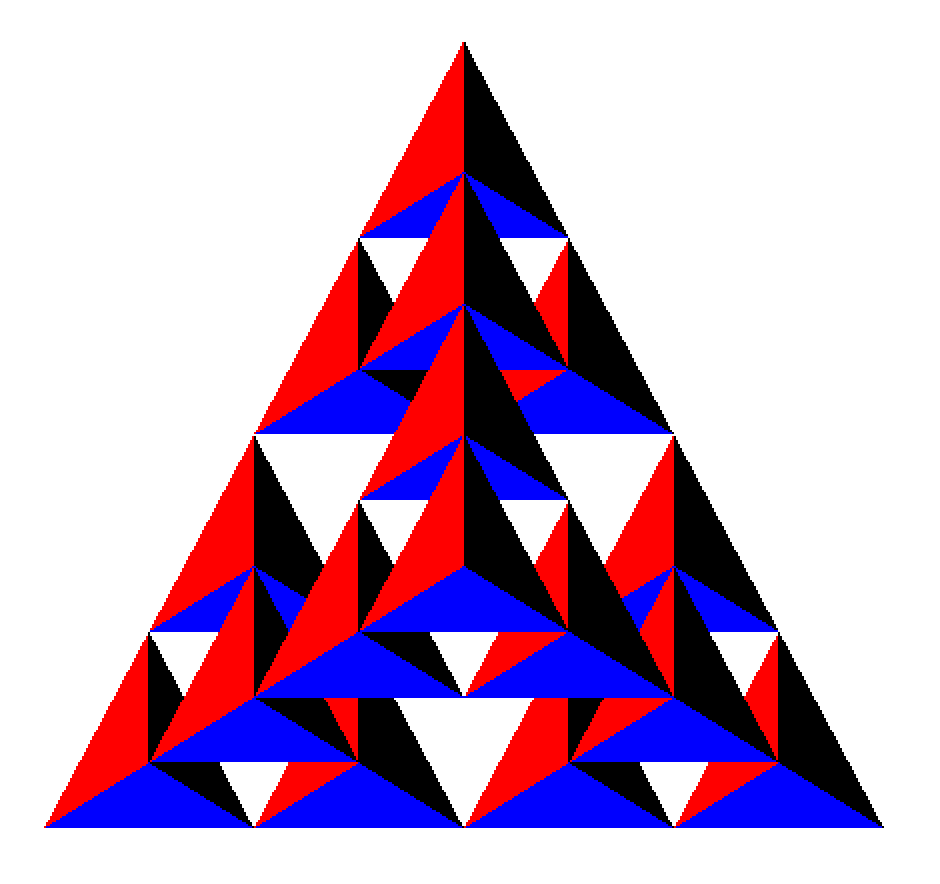

## Aim
Program to recursively subdivide a tetrahedron to from 3D Sierpinski gasket. The number of recursive steps is to be specified by the user.

## Theory
A geometric method of creating the gasket is to start with a vertex of the object and get all the mid points to the other vertices. This results in smaller structure of the original geometric object (repeat for all the vertices). For another iteration take the smaller object and perform the same as above.

The gasket is perfectly self similar, an attribute of many fractal images. Any portion is an exact replica of the phase of the gasket The construction of the 3 dimensional version of the gasket follows similar rules for the 2D case except that the building blocks are square based pyramids instead of triangles.

## Algorithm
1. Start with a tetrahedron.
2. Inside this, take the edges, calculate their midpoints.
3. Now, from each original vertex construct a new tetrahedron consisting of vertex `(original, midpoint, midpoint, midpoint)`
4. Repeat it recursively (till `m > 0`)
5. At `m = 0`, draw all the leaf nodes of the recursive tree

## Code
```
#include <stdio.h>

// Apple Specific Compatibility Issues
#ifdef __APPLE__
	#include "GLUT/glut.h"
#else
	#include "GL\glut.h"
#endif

// Each point must have 3 vertices
typedef float point[3];

// Variable for number of divisions
int n;

// Initial vertices to form a triangle
point v[] = {
  {0, 0, 1}, {0, 1, -0.33},
  {-0.8, -0.5, -0.33}, {0.8, -0.5, -0.33}
};

// Function to draw a triangle
void drawTriangle(point a, point b, point c) {
  glBegin(GL_POLYGON);
  glVertex3fv(a);
  glVertex3fv(b);
  glVertex3fv(c);
  glEnd();
}

// Function to calculate midpoint of two points
// and save it in first point array
void calcMidpoint(point save, point a, point b) {
  save[0] = (a[0] + b[0]) / 2;
  save[1] = (a[1] + b[1]) / 2;
  save[2] = (a[2] + b[2]) / 2;
}

// Function to divide tetrahedron recursively
void divideTetrahedron(point a, point b, point c, point d, int m) {
  // Pattern: a-bcd, b-cd, c-d
  point ab, ac, ad, bc, bd, cd;

  // Repeat 'm' no. of times, as specified by the user
  if (m > 0) {
    // To find out the midpoint of xy -> xy, x, y
    calcMidpoint(ab, a, b);
    calcMidpoint(ac, a, c);
    calcMidpoint(ad, a, d);
    calcMidpoint(bc, b, c);
    calcMidpoint(bd, b, d);
    calcMidpoint(cd, c, d);

    // Consider the midpoints as vertices, and
    // Divide the bigger triangle to 3 parts, recursively
    divideTetrahedron(a, ab, ac, ad, m - 1);
    divideTetrahedron(ab, b, bc, bd, m - 1);
    divideTetrahedron(ac, bc, c, cd, m - 1);
    divideTetrahedron(ad, bd, cd, d, m - 1);
  } else {
    glColor3f(1, 0, 0); // Red
    drawTriangle(a, b, c);

    glColor3f(0, 0, 1); // Green
    drawTriangle(a, c, d);

    glColor3f(0, 1, 0); // Blue
    drawTriangle(c, b, d);

    glColor3f(0, 0, 0); // Black
    drawTriangle(a, b, d);
  }
}

void display() {
  glClear(GL_COLOR_BUFFER_BIT|GL_DEPTH_BUFFER_BIT);
  glLoadIdentity();

  // Call the `divideTetrahedron()` function for the first time
  divideTetrahedron(v[0], v[1], v[2], v[3], n);

  glFlush();
}

// Function to redraw the window in case the window resized
void reshape(int w, int h) {
  glViewport(0, 0, w, h);
  glMatrixMode(GL_PROJECTION);
  glLoadIdentity();

  if (w <= h)
    glOrtho(-2, 2, -2 * h / w, 2 * h / w, -10, 10);
  else
    glOrtho(-2 * w / h, 2 * w / h, -2, 2, -10, 10);

  glMatrixMode(GL_MODELVIEW);
  glutPostRedisplay();
}

int main(int argc, char *argv[]) {
  // Ask user input for number of divisions
  printf("Number of Divisions: ");
  scanf("%d", &n);

  glutInit(&argc, argv);
  glutInitDisplayMode(GLUT_SINGLE|GLUT_RGB|GLUT_DEPTH);
  glutInitWindowSize(500, 500);
  glutCreateWindow("3D Sierpinski Gasket");

  // Enable `GL_DEPTH_TEST` to activate depth and transparency
  glEnable(GL_DEPTH_TEST);

  glutReshapeFunc(reshape);
  glutDisplayFunc(display);

  // Set background color to white
  glClearColor(1, 1, 1, 1);
  glutMainLoop();

  return 0;
}
```

## Execution
```
g++ -framework OpenGL -framwork GLUT 01_SierpinskiGasket.c -w
./a.out
```

## Output

