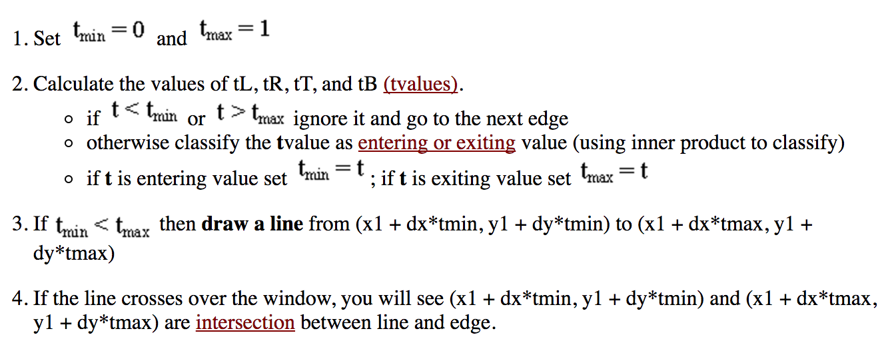
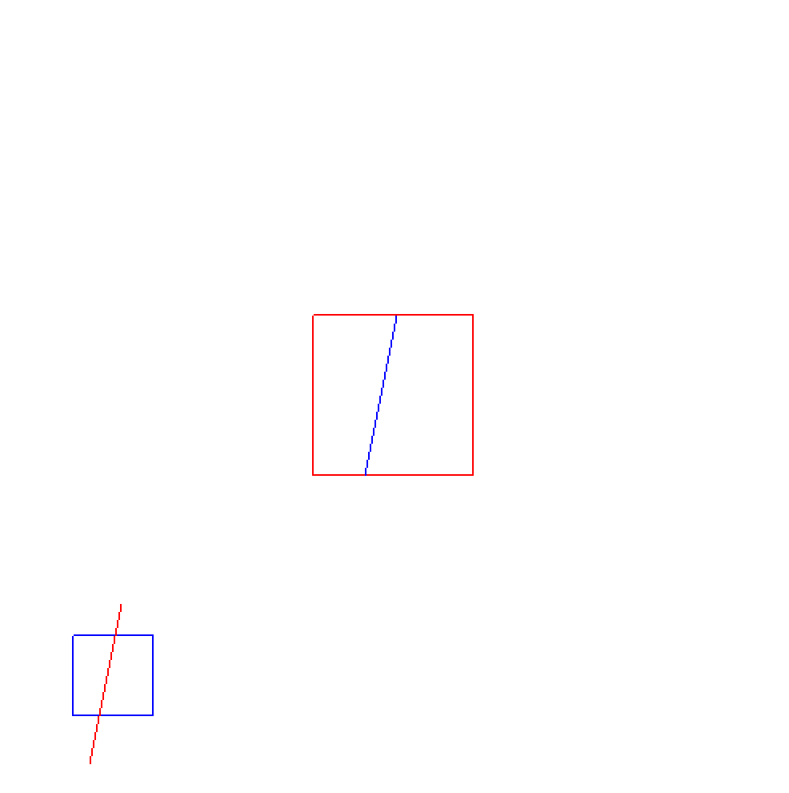

## Aim
Program to implement Liang-Barsky Line Clipping Algorithm

## Theory
In computer graphics, 'line clipping' is the process of removing lines or portions of lines outside of an area of interest. Typically, any line or part thereof which is outside of the viewing area is removed.

The Liang-Barsky algorithm uses the parametric equation of a line and inequalities describing the range of the clipping window to determine the intersections between the line and the clipping window. With these intersections it knows which portion of the line should be drawn.

## Algorithm


## Code
```
#include <stdio.h>

// Apple Specific Compatibility Issues
#ifdef __APPLE__
	#include "GLUT/glut.h"
#else
	#include "GL\glut.h"
#endif

// Boolean Values
#define true 1
#define false 0

// Window Boundary
double xmin = 50, ymin = 50, xmax = 100, ymax = 100;
// Viewport Boundary
double xvmin = 200, yvmin = 200, xvmax = 300, yvmax = 300;

// To check where the Line Portion Lies
int cliptest(double p, double q, double *t1, double *t2) {
	double t = q / p;

	if (p < 0) {
		if (t > *t1) *t1 = t;
		if (t > *t2) return false;
	} else if (p > 0) {
		if (t < *t2) *t2 = t;
		if (t < *t1) return false;
	} else {
		if (q < 0) return false;
	}

	return true;
}

void liangBarsky(double x0, double y0, double x1, double y1) {
	double dx = x1 - x0,
		dy = y1 - y0,
		te = 0, tl = 1;

		// -dx, dx, -dy, dy
		// xmin, xmax, ymin, ymax
		// x0 -, - x0, y0 -, - y0
		// &te, &tl
		if (cliptest(-dx, x0 - xmin, &te, &tl)) // inside test w.r.t. left edge
			if (cliptest(dx, xmax - x0, &te, &tl)) // inside test w.r.t. right edge
				if (cliptest(-dy, y0 - ymin, &te, &tl)) // inside test w.r.t. bottom edge
					if (cliptest(dy, ymax - y0, &te, &tl)) { // inside test w.r.t. top edge

						// In order to clip the top
						if (tl < 1) {
							x1 = x0 + tl * dx;
							y1 = y0 + tl * dy;
						}

						// In order to clip the bottom
						if (te > 0) {
							x0 = x0 + te * dx;
							y0 = y0 + te * dy;
						}

						// `sx` and `sy` are used to scale the line
						// it zooms into the clipping window
						double sx = (xvmax - xvmin) / (xmax - xmin);
						double sy = (yvmax - yvmin) / (ymax - ymin);

						// Calculate (x0, y0) of the Clipped Line
						double vx0 = xvmin + (x0 - xmin) * sx;
						double vy0 = yvmin + (y0 - ymin) * sy;

						// Calculate (x1, y1) of the Clipped Line
						double vx1 = xvmin + (x1 - xmin) * sx;
						double vy1 = yvmin + (y1 - ymin) * sy;

						// Draw Viewport to Display Clipped Line
						// in Red Color
						glColor3f(1, 0, 0);
						glBegin(GL_LINE_LOOP);
						glVertex2f(xvmin, yvmin);
						glVertex2f(xvmax, yvmin);
						glVertex2f(xvmax, yvmax);
						glVertex2f(xvmin, yvmax);
						glEnd();

						// Draw Clipped Line
						// in Blue Color
						glColor3f(0, 0, 1);
						glBegin(GL_LINES);
						glVertex2f(vx0, vy0);
						glVertex2f(vx1, vy1);
						glEnd();
					}
}

void display() {
	// Unclipped Line Cooordinates
	double x0 = 60, y0 = 20,
		x1 = 80, y1 = 120;

	// Clear the Color Buffer
	glClear(GL_COLOR_BUFFER_BIT);

	// Draw Window Boundary Box for Unclipped Line
	// in Blue Color
	glColor3f(0, 0, 1);
	glBegin(GL_LINE_LOOP);
	glVertex2f(xmin, ymin);
	glVertex2f(xmax, ymin);
	glVertex2f(xmax, ymax);
	glVertex2f(xmin, ymax);
	glEnd();

	// Draw Unclipped Line
	// in Red Color
	glColor3f(1, 0, 0);
	glBegin(GL_LINES);
	glVertex2f(x0, y0);
	glVertex2f(x1, y1);
	glEnd();

	// Call liangBarsky() by passing Line Arguments
	liangBarsky(x0, y0, x1, y1);
	glFlush();
}

// Initialize Default Colors and Viewport Size
void glInit() {
	// Set Default Background Color to White
	glClearColor(1, 1, 1, 1);

	// Optional Code
	glMatrixMode(GL_PROJECTION);
	glLoadIdentity();

	// Set Viewport to 2D Orthographic Projection
	gluOrtho2D(0, 500, 0, 500);
}

int main(int argc, char *argv[]) {
  glutInit(&argc, argv);
  glutInitDisplayMode(GLUT_SINGLE | GLUT_RGB);
  glutInitWindowSize(500, 500);
  glutCreateWindow("Liang-Barsky Line Clipping Algorithm");

  glutDisplayFunc(display);

	glInit();
  glutMainLoop();
}

```

## Execution
```
g++ -framework OpenGL -framework GLUT 02_LiangBarsky.c -w
./a.out
```

## Output

