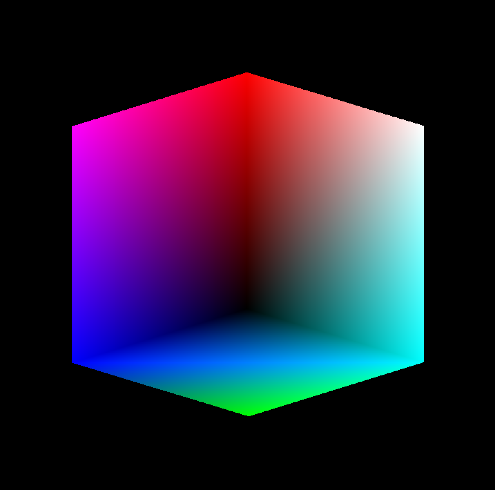

## Aim
Program to draw a color cube and spin it using OpenGL transformation matrices.

## Algorithm
1. Choose eight 3 dimensional coordinate points such that will make a cube
2. Group the vertices together such that they make 6 faces.
3. Identify the button that was last pressed.
4. Rotate the cube by a small angle, along a particular axis;  
by associating one mouse button to one axis.

The following values assume vertices as show below:

```
   5-------6
  /|      /|
 / |     / |
1-------2  |
|  4----|--7
| /     | /
|/      |/
0-------3
```

## Code
```
#include <stdio.h>
#include <stdlib.h>

// Apple Specific Compatibility Issues
#ifdef __APPLE__
#include "GLUT/glut.h"
#else
#include "GL\glut.h"
#endif

GLfloat vertices[][3] = {{-1, -1, -1}, {1, -1, -1}, {1, 1, -1}, {-1, 1, -1},
                         {-1, -1, 1},  {1, -1, 1},  {1, 1, 1},  {-1, 1, 1}};

GLfloat normals[][3] = {{-1, -1, -1}, {1, -1, -1}, {1, 1, -1}, {-1, 1, -1},
                        {-1, -1, 1},  {1, -1, 1},  {1, 1, 1},  {-1, 1, 1}};

GLfloat colors[][3] = {{0, 0, 0}, {1, 0, 0}, {1, 1, 0}, {0, 1, 0},
                       {0, 0, 1}, {1, 0, 1}, {1, 1, 1}, {0, 1, 1}};

void polygon(int a, int b, int c, int d) {
  glBegin(GL_POLYGON);

  glColor3fv(colors[a]);
  glNormal3fv(normals[a]);
  glVertex3fv(vertices[a]);

  glColor3fv(colors[b]);
  glNormal3fv(normals[b]);
  glVertex3fv(vertices[b]);

  glColor3fv(colors[c]);
  glNormal3fv(normals[c]);
  glVertex3fv(vertices[c]);

  glColor3fv(colors[d]);
  glNormal3fv(normals[d]);
  glVertex3fv(vertices[d]);

  glEnd();
}

void colorCube() {
  polygon(0, 3, 2, 1);
  polygon(2, 3, 7, 6);
  polygon(0, 4, 7, 3);
  polygon(1, 2, 6, 5);
  polygon(4, 5, 6, 7);
  polygon(0, 1, 5, 4);
}

static GLfloat theta[] = {0, 0, 0};
static GLint axis = 2;

void display(void) {
  glClear(GL_COLOR_BUFFER_BIT | GL_DEPTH_BUFFER_BIT);
  glLoadIdentity();

  glRotatef(theta[0], 1, 0, 0);
  glRotatef(theta[1], 1, 1, 0);
  glRotatef(theta[2], 1, 0, 1);
  colorCube();

  glutSwapBuffers();
}

void spinCube() {
  theta[axis] += 1;

  if (theta[axis] > 360)
    theta[axis] -= 360;

  glutPostRedisplay();
}

void mouse(int btn, int state, int x, int y) {
  if (btn == GLUT_LEFT_BUTTON && state == GLUT_DOWN)
    axis = 0;
  if (btn == GLUT_MIDDLE_BUTTON && state == GLUT_DOWN)
    axis = 1;
  if (btn == GLUT_RIGHT_BUTTON && state == GLUT_DOWN)
    axis = 2;
}

void reshape(int w, int h) {
  glViewport(0, 0, w, h);

	glMatrixMode(GL_PROJECTION);
  glLoadIdentity();

  if (w <= h)
    glOrtho(-2, 2, -2 * h / w, 2 * h / w, -10, 10);
  else
    glOrtho(-2 * w / h, 2 * w / h, -2, 2, -10, 10);

	glMatrixMode(GL_MODELVIEW);
}

int main(int argc, char **argv) {
  glutInit(&argc, argv);
  glutInitDisplayMode(GLUT_DOUBLE | GLUT_RGB | GLUT_DEPTH);

  glutInitWindowSize(500, 500);
  glutCreateWindow("Color Cube");

  glutReshapeFunc(reshape);
  glutDisplayFunc(display);
  glutIdleFunc(spinCube);
  glutMouseFunc(mouse);

  glEnable(GL_DEPTH_TEST);

  glutMainLoop();
}
```

## Execution
```
g++ -framework OpenGL -framework GLUT 03_SpinCube.c -w
./a.out
```

## Output

