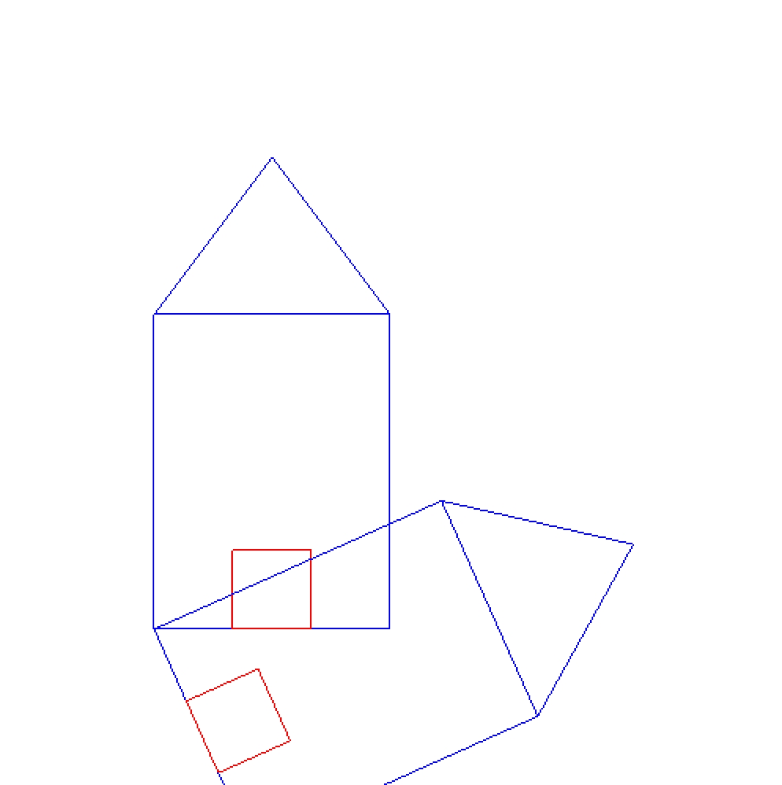

## Aim
Program to create a house like figure and rotate it about a given fixed point using OpenGL functions.

## Algorithm
1. Draw a house by choosing appropriate coordinate points.
2. Calculate the rotation matrix, which is calculate w.r.t rotation angle.
3. Multiply rotation matrix with coordinate points of house.
4. This gives us co-ordinate points of rotated house

## Code
```
#include <stdio.h>
#include <math.h>

// Apple Specific Compatibility Issues
#ifdef __APPLE__
	#include "GLUT/glut.h"
#else
	#include "GL\glut.h"
#endif

GLfloat house[3][9] = {
  {100, 100, 175, 250, 250, 150, 150, 200, 200},
  {100, 300, 400, 300, 100, 100, 150, 150, 100},
  {1, 1, 1, 1, 1, 1, 1, 1, 1}
};

GLfloat rot_mat[3][3] = {{0}, {0}, {0}};
GLfloat result[3][9] = {{0}, {0}, {0}};
GLfloat h = 100;
GLfloat k = 100;
GLfloat theta;

void multiply() {
  int i, j, l;

  for (i = 0; i < 3; i++) {
    for (j = 0; j < 9; j++) {
      result[i][j] = 0;

      for (l = 0; l < 3; l++) {
        result[i][j] += rot_mat[i][l] * house[l][j];
      }
    }
  }
}

void rotate() {
  GLfloat m, n;
  m = -h * (cos(theta) - 1) + k * (sin(theta));
  n = -k * (cos(theta) - 1) - h * (sin(theta));

  rot_mat[0][0] = cos(theta);
  rot_mat[0][1] = -sin(theta);
  rot_mat[0][2] = m;
  rot_mat[1][0] = sin(theta);
  rot_mat[1][1] = cos(theta);
  rot_mat[1][2] = n;
  rot_mat[2][0] = 0;
  rot_mat[2][1] = 0;
  rot_mat[2][2] = 1;

  multiply();
}

// Draw the Initial House, unrotated
void drawHouse() {
  glColor3f(0, 0, 1);
  glBegin(GL_LINE_LOOP);
    glVertex2f(house[0][0], house[1][0]);
    glVertex2f(house[0][1], house[1][1]);
    glVertex2f(house[0][3], house[1][3]);
    glVertex2f(house[0][4], house[1][4]);
  glEnd();

  glColor3f(1, 0, 0);
  glBegin(GL_LINE_LOOP);
    glVertex2f(house[0][5], house[1][5]);
    glVertex2f(house[0][6], house[1][6]);
    glVertex2f(house[0][7], house[1][7]);
    glVertex2f(house[0][8], house[1][8]);
  glEnd();

  glColor3f(0, 0, 1);
  glBegin(GL_LINE_LOOP);
    glVertex2f(house[0][1], house[1][1]);
    glVertex2f(house[0][2], house[1][2]);
    glVertex2f(house[0][3], house[1][3]);
  glEnd();
}

// Draw the Rotated House
void drawRotatedHouse() {
  glColor3f(0, 0, 1);
  glBegin(GL_LINE_LOOP);
    glVertex2f(result[0][0], result[1][0]);
    glVertex2f(result[0][1], result[1][1]);
    glVertex2f(result[0][3], result[1][3]);
    glVertex2f(result[0][4], result[1][4]);
  glEnd();

  glColor3f(1, 0, 0);
  glBegin(GL_LINE_LOOP);
    glVertex2f(result[0][5], result[1][5]);
    glVertex2f(result[0][6], result[1][6]);
    glVertex2f(result[0][7], result[1][7]);
    glVertex2f(result[0][8], result[1][8]);
  glEnd();

  glColor3f(0, 0, 1);
  glBegin(GL_LINE_LOOP);
    glVertex2f(result[0][1], result[1][1]);
    glVertex2f(result[0][2], result[1][2]);
    glVertex2f(result[0][3], result[1][3]);
  glEnd();
}

void display() {
  glClear(GL_COLOR_BUFFER_BIT);

  drawHouse();
  rotate();
  drawRotatedHouse();

  glFlush();
}

void glInit() {
  glClearColor(1, 1, 1, 1);
  glColor3f(1, 1, 0);
  glPointSize(10);
  glMatrixMode(GL_PROJECTION);
  glLoadIdentity();
  gluOrtho2D(0, 500, 0, 500);
}

int main(int argc, char **argv) {
  printf("Enter the angle of rotation: ");
  scanf("%f", &theta);

  glutInit(&argc, argv);
  glutInitDisplayMode(GLUT_SINGLE | GLUT_RGB);
  glutInitWindowSize(500, 500);
  glutInitWindowPosition(0, 0);
  glutCreateWindow("House Rotation");
  glutDisplayFunc(display);
  glInit();
  glutMainLoop();
}
```

## Alternate Code
```
#include <stdio.h>
#include <math.h>

// Apple Specific Compatibility Issues
#ifdef __APPLE__
	#include "GLUT/glut.h"
#else
	#include "GL\glut.h"
#endif

GLfloat theta;

void drawHouse() {
  glColor3f(1, 0, 0);
  glBegin(GL_LINE_LOOP);
    glVertex2f(150, 75);
    glVertex2f(350, 75);
    glVertex2f(350, 300);
    glVertex2f(150, 300);
  glEnd();

  glBegin(GL_LINE_LOOP);
    glVertex2f(200, 75);
    glVertex2f(300, 75);
    glVertex2f(300, 200);
    glVertex2f(200, 200);
  glEnd();

  glBegin(GL_LINES);
    // Triangle Left
    glVertex2f(150, 300);
    glVertex2f(250, 400);
    // Triangle Right
    glVertex2f(250, 400);
    glVertex2f(350, 300);
  glEnd();
}

void drawRotatedHouse() {
  glPushMatrix();

  glRotatef(theta, 0, 0, 1);

  glColor3f(1, 0, 0);
  glBegin(GL_LINE_LOOP);
    glVertex2f(150, 75);
    glVertex2f(350, 75);
    glVertex2f(350, 300);
    glVertex2f(150, 300);
  glEnd();

  glBegin(GL_LINE_LOOP);
    glVertex2f(200, 75);
    glVertex2f(300, 75);
    glVertex2f(300, 200);
    glVertex2f(200, 200);
  glEnd();

  glBegin(GL_LINES);
    // Triangle Left
    glVertex2f(150, 300);
    glVertex2f(250, 400);
    // Triangle Right
    glVertex2f(250, 400);
    glVertex2f(350, 300);
  glEnd();

  glPopMatrix();
}

void display() {
  glClear(GL_COLOR_BUFFER_BIT);

  drawHouse();
  drawRotatedHouse();

  glFlush();
}

void glInit() {
  glClearColor(1, 1, 1, 1);
  glColor3f(1, 1, 0);
  glPointSize(10);
  glMatrixMode(GL_PROJECTION);
  glLoadIdentity();
  gluOrtho2D(0, 500, 0, 500);
}

int main(int argc, char **argv) {
  printf("Enter the angle of rotation: ");
  scanf("%f", &theta);

  glutInit(&argc, argv);
  glutInitDisplayMode(GLUT_SINGLE | GLUT_RGB);
  glutInitWindowSize(500, 500);
  glutInitWindowPosition(0, 0);
  glutCreateWindow("House Rotation");
  glutDisplayFunc(display);
  glInit();
  glutMainLoop();
}
```

## Execution
```
g++ -framework OpenGL -framework GLUT 04_RotateHouse.c -w
./a.out
```

## Output

