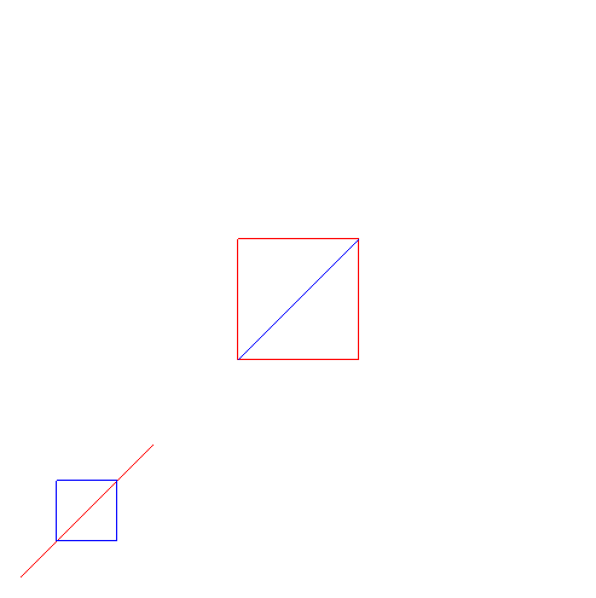

## Aim
Program to implement the Cohen-Sutherland line-clipping algorithm. Make provision to specify the input line, window for clipping and view port for displaying the clipped image.

## Algorithm
1. End-points pairs are check for trivial acceptance or trivial rejected using the outcode.
2. If not trivially accepted or trivially rejected, divided into two segments at a clip edge.
3. Iteratively clipped by testing trivial-acceptance or trivial-rejected, and divided into two segments until completely 	inside or trivial-rejected.
4. To perform trivial accept and reject tests, we extend the edges of the clip rectangle to divide the plane of the clip rectangle into nine regions. Each region is assigned a 4-bit code determined by where the region lies with respect to the outside half-planes of the clip-rectangle edges. Each bit in the outcode is set to either 1 (true) or 0 (false); the 4 bits in the code correspond to the following conditions:
	* **Bit 1**: outside half-plane of top edge, above top edge `(Y > Ymax)`
	* **Bit 2**: outside half-plane of bottom edge, below bottom edge `(Y < Ymin)`
	* **Bit 3**: outside half-plane of right edge, to the right of right edge `(X > Xmax)`
	* **Bit 4**: outside half-plane of left edge, to the left of left edge `(X < Xmin)`

## Theory
In computer graphics, 'line clipping' is the process of removing lines or portions of lines outside of an area of interest. Typically, any line or part thereof which is outside of the viewing area is removed.

The Cohen-Sutherland Algorithm is a computer graphics algorithm used for line clipping. The algorithm divides a two-dimensional space into 9 regions (or a three-dimensional space into 27 regions), and then efficiently determines the lines and portions of lines that are visible in the center region of interest (the viewport).

The algorithm quickly detects and dispenses with two common and trivial cases. To clip a line, we need to consider only its endpoints. If both endpoints of a line lie inside the window, the entire line lies inside the window. It is trivially accepted and needs no clipping. On the other hand, if both endpoints of a line lie entirely to one side of the window, the line must lie entirely outside of the window. It is trivially rejected and needs to be neither clipped nor displayed.

## Code
```
#include <stdio.h>

// Apple Specific Compatibility Issues
#ifdef __APPLE__
	#include "GLUT/glut.h"
#else
	#include "GL\glut.h"
#endif

// Aliasing int as outcode
#define outcode int

// Smaller Window Boundary
double xmin = 50, ymin = 50, xmax = 100, ymax = 100;

// Larger Viewport Boundary
double xvmin = 200, yvmin = 200, xvmax = 300, yvmax = 300;

// Bitcode for Bottom, Left, Top, Right
const int BOTTOM = 1; // 1 is 0001
const int LEFT = 2;   // 2 is 0010
const int TOP = 4;    // 4 is 0100
const int RIGHT = 8;  // 8 is 1000

int x1, x2, y1, y2;

// Used to Compute the Bitcode of a Point
outcode computeOutcode(double x, double y);

// Cohen-Sutherland clipping algo clips a line from
// P0 = (x0, y0) to P1 = (x1, y1) against a rectangle with
// diagonal from (xmin, ymin) to (xmax, ymax)
void cohenSutherlandLineClipAndDraw(double x0, double y0, double x1, double y1) {
  outcode outcode0, outcode1, outcodeOut;
  bool accept = false, done = false;

  // compute outcodes
  outcode0 = computeOutcode(x0, y0);
  outcode1 = computeOutcode(x1, y1);
  do {
    // If logical OR is 0, then trivially accept & exit
    if (!(outcode0 | outcode1)) {
      accept = true;
      done = true;
    }

    // If logical AND is 0, then trivially reject & exit
    else if (outcode0 & outcode1) {
      done = true;
    } else {
      // If it has failed both tests, then calculate the line segment to clip
      // from an outside point to an intersection with clip edge
      double x, y;

      // Atleast one endpoint is outside the clip rectangle, pick it.
      outcodeOut = outcode0 ? outcode0 : outcode1;

      // Now, find the intersection point.
      // Use the formula:
      // y = y0 + slope * (x - x0);
      // x = x0 + (1 / slope) * (y - y0);

      // Point is above the rectangular clip
      if (outcodeOut & TOP) {
        x = x0 + (x1 - x0) * (ymax - y0) / (y1 - y0);
        y = ymax;
      }

      // Point is below the clip rectangle
      else if (outcodeOut & BOTTOM) {
        x = x0 + (x1 - x0) * (ymin - y0) / (y1 - y0);
        y = ymin;
      }

      // Point lies right of clipping rectangle
      else if (outcodeOut & RIGHT) {
        y = y0 + (y1 - y0) * (xmax - x0) / (x1 - x0);
        x = xmax;
      }

      // Point lies left of clipping rectangle
      else {
        y = y0 + (y1 - y0) * (xmin - x0) / (x1 - x0);
        x = xmin;
      }

      // Now, we move the outside point to intersection point to
      // clip and get ready for next pass
      if (outcodeOut == outcode0) {
        x0 = x;
        y0 = y;
        outcode0 = computeOutcode(x0, y0);
      } else {
        x1 = x;
        y1 = y;
        outcode1 = computeOutcode(x1, y1);
      }
    }
  } while (!done);
  if (accept) {
    // Calculate the Scale Factor
    double sx = (xvmax - xvmin) / (xmax - xmin);
    double sy = (yvmax - yvmin) / (ymax - ymin);

    double vx0 = xvmin + (x0 - xmin) * sx;
    double vy0 = yvmin + (y0 - ymin) * sy;
    double vx1 = xvmin + (x1 - xmin) * sx;
    double vy1 = yvmin + (y1 - ymin) * sy;

    // Draw a Blue Colored Viewport
    glColor3f(1.0, 0.0, 0.0);
    glBegin(GL_LINE_LOOP);
    glVertex2f(xvmin, yvmin);
    glVertex2f(xvmax, yvmin);
    glVertex2f(xvmax, yvmax);
    glVertex2f(xvmin, yvmax);
    glEnd();

    // Draws Blue Colored Lines
    glColor3f(0.0, 0.0, 1.0);
    glBegin(GL_LINES);
    glVertex2d(vx0, vy0);
    glVertex2d(vx1, vy1);
    glEnd();
  }
}

// Compute the Bitcode for a point(x, y) using the clip rectangle
// bounded diagonally by (xmin, ymin) and (xmax, ymax)
outcode computeOutcode(double x, double y) {
  outcode code = 0;
  if (y > ymax) {
    code |= TOP;
  } else if (y < ymin) {
    code |= BOTTOM;
  }
  if (x > xmax) {
    code |= RIGHT;
  } else if (x < xmin) {
    code |= LEFT;
  }
  return code;
}

void display() {
  glClear(GL_COLOR_BUFFER_BIT);

  // Draw the lines with Red Color
  glColor3f(1.0, 0.0, 0.0);
  glBegin(GL_LINES);
  glVertex2d(x1, y1);
  glVertex2d(x2, y2);
  glEnd();

  // Draw a Blue Colored Window
  glColor3f(0.0, 0.0, 1.0);
  glBegin(GL_LINE_LOOP);
  glVertex2f(xmin, ymin);
  glVertex2f(xmax, ymin);
  glVertex2f(xmax, ymax);
  glVertex2f(xmin, ymax);
  glEnd();

  cohenSutherlandLineClipAndDraw(x1, y1, x2, y2);
  glFlush();
}

void glInit() {
  glClearColor(1.0, 1.0, 1.0, 1.0);
  glColor3f(1.0, 0.0, 0.0);
  glPointSize(1.0);
  glMatrixMode(GL_PROJECTION);
  glLoadIdentity();
  gluOrtho2D(0.0, 500.0, 0.0, 500.0);
}

int main(int argc, char **argv) {
  printf("Enter End Points: (x1, y1, x2, y2)\n");
  scanf("%d%d%d%d", &x1, &y1, &x2, &y2);
  glutInit(&argc, argv);
  glutInitDisplayMode(GLUT_SINGLE | GLUT_RGB);
  glutInitWindowSize(500, 500);
  glutInitWindowPosition(0, 0);
  glutCreateWindow("Cohen-Sutherland Line Clipping Algorithm");
  glutDisplayFunc(display);
  glInit();
  glutMainLoop();
}
```

## Execution
```
g++ -framework OpenGL -framework GLUT 05_CohenSutherland.c -w
./a.out
Enter End Points: (x1, y1, x2, y2)
25 25
125 125
```

## Output

