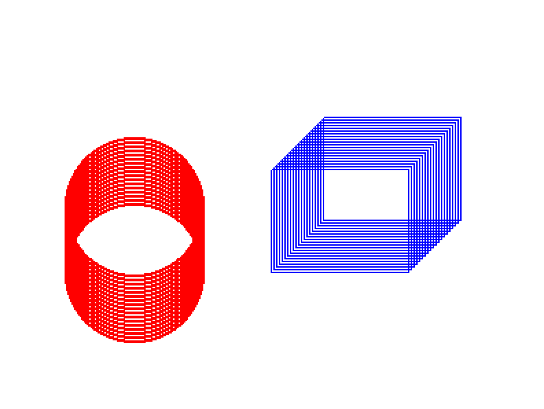

## Aim
Program to create a Cylinder and a Parallelepiped by extruding a circle and quadrilateral respectively.

## Algorithm
1. Under `cylinderDraw()` function, we call the `circleDraw()` function inside a `for` loop.
2. The `circleDraw()` function is a midpoint circle drawing algorithm which draws a circle by calling `plotPixel()` method. The `plotPixel()` method draws the cylinder by plotting multiple pixels.
3. The `parallelepipedDraw()` module calls the `parallelepiped()` module inside a `for` loop which draws the parallelepiped onto the screen.

## Theory
In geometry, a **parallelepiped** is a three-dimensional figure formed by six parallelograms (the term rhomboid is also sometimes used with this meaning). By analogy, it relates to a parallelogram just as a cube relates to a square or as a cuboid to a rectangle.

## Code
```
#include <math.h>
#include <stdio.h>
#include <stdlib.h>

// Apple Specific Compatibility Issues
#ifdef __APPLE__
#include "GLUT/glut.h"
#else
#include "GL\glut.h"
#endif

void circleDraw(float cx, float cy, float r) {
  int n = 100;

  glBegin(GL_LINE_LOOP);
  for (int i = 0; i < n; i++) {
    float theta = 2.0f * 3.14f * float(i) / float(n);
    float x = r * cosf(theta);
    float y = r * sin(theta);
    glVertex2f(x + cx, y + cy);
  }
  glEnd();
}

void cylinderDraw() {
  GLint xc = 50, yc = 50, r = 50;
  GLint i, n = 50;
  for (i = 0; i < n; i += 3)
    circleDraw(xc, yc + i, r);
}
void parallelepiped(int x1, int x2, int y1, int y2) {
  glColor3f(0, 0, 1);
  glPointSize(2);
  glBegin(GL_LINE_LOOP);
    glVertex2i(x1, y1);
    glVertex2i(x2, y1);
    glVertex2i(x2, y2);
    glVertex2i(x1, y2);
  glEnd();
}

void parallelepipedDraw() {
  int x1 = 100, x2 = 200, y1 = 100, y2 = 200;
  GLint i, n = 40;
  for (i = 0; i < n; i += 2)
    parallelepiped(x1 + i, x2 + i, y1 + i, y2 + i);
}

void glInit() {
  glClearColor(1, 1, 1, 1);
  glMatrixMode(GL_PROJECTION);
  gluOrtho2D(0, 400, 0, 300);
}

void display(void) {
  glClear(GL_COLOR_BUFFER_BIT);
  glColor3f(1, 0, 0);
  glPointSize(2);

  cylinderDraw();
  parallelepipedDraw();

  glFlush();
}

int main(int argc, char **argv) {
  glutInit(&argc, argv);
  glutInitDisplayMode(GLUT_SINGLE | GLUT_RGB);

  glutInitWindowPosition(50, 50);
  glutInitWindowSize(400, 300);
  glutCreateWindow("Cylinder & Parallelepiped");

  glInit();
  glutDisplayFunc(display);

  glutMainLoop();
}
```

## Execution
```
g++ -framework OpenGL -framework GLUT 06_Parallelpiped.c -w
./a.out
```

## Output

