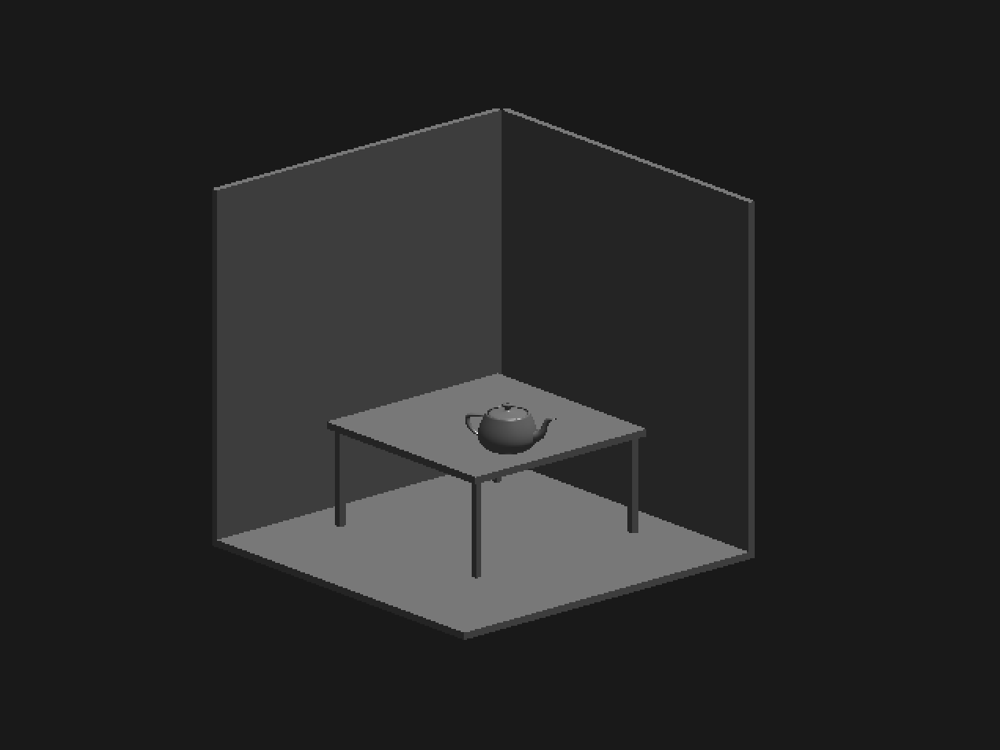

## Aim
Write a program using OpenGL functions, to draw a simple shaded scene consisting of a tea pot on a table. Define suitably the position and properties of the light source along with the properties of the properties of the surfaces of the solid object used in the scene.

## Algorithm
1. Use function `glutSolidCube()` to draw wall and table.
2. Use the same function to draw 4 cubes and then scale it in downward direction to make it look like table legs.
3. `glutSolidTeapot()` is used to draw teapot.

## Code
```
#include <stdio.h>
#include <math.h>

// Apple Specific Compatibility Issues
#ifdef __APPLE__
	#include "GLUT/glut.h"
#else
	#include "GL\glut.h"
#endif

void drawPixel(GLint cx, GLint cy) {
  glColor3f(1.0, 0.0, 0.0);
  glBegin(GL_POINTS);
  glVertex2i(cx, cy);
  glEnd();
}
void plotPixels(GLint h, GLint k, GLint x, GLint y) {
  drawPixel(x + h, y + k);
  drawPixel(-x + h, y + k);
  drawPixel(x + h, -y + k);
  drawPixel(-x + h, -y + k);
  drawPixel(y + h, x + k);
  drawPixel(-y + h, x + k);
  drawPixel(y + h, -x + k);
  drawPixel(-y + h, -x + k);
}

// Midpoint Circle Drawing Algorithm
void circleDraw(GLint h, GLint k, GLint r) {
  GLint d = 1 - r, x = 0, y = r;
  while (y > x) {
    plotPixels(h, k, x, y);
    if (d < 0)
      d += 2 * x + 3;
    else {
      d += 2 * (x - y) + 5;
      --y;
    }
    ++x;
  }
  plotPixels(h, k, x, y);
}

void cylinderDraw() {
  GLint xc = 100, yc = 100, r = 50;
  GLint i, n = 50;

  for (i = 0; i < n; i += 3)
    circleDraw(xc, yc + i, r);
}

void parallelepiped(int x1, int x2, int y1, int y2, int y3, int y4) {
  glColor3f(0.0, 0.0, 1.0);
  glPointSize(2.0);
  glBegin(GL_LINE_LOOP);
  glVertex2i(x1, y1);
  glVertex2i(x2, y3);
  glVertex2i(x2, y4);
  glVertex2i(x1, y2);
  glEnd();
}

void parallelepipedDraw() {
  int x1 = 200, x2 = 300, y1 = 100, y2 = 175, y3 = 100, y4 = 175;
  GLint i, n = 40;

  for (i = 0; i < n; i += 2)
    parallelepiped(x1 + i, x2 + i, y1 + i, y2 + i, y3 + i, y4 + i);
}

void glInit(void) {
  // Set Display Window color to White
  glClearColor(1.0, 1.0, 1.0, 0.0);
  glMatrixMode(GL_PROJECTION);
  gluOrtho2D(0.0, 400.0, 0.0, 300.0);
}

void display(void) {
  // Clear Display Window
  glClear(GL_COLOR_BUFFER_BIT);

  // Set Circle Color to Red
  glColor3f(1.0, 0.0, 0.0);
  glPointSize(2.0);

  // Draw Cylinder
  cylinderDraw();

  // Draw Parallelepiped
  parallelepipedDraw();

  glFlush();
}

int main(int argc, char **argv) {
  glutInit(&argc, argv); // Initialize GLUT
  glutInitDisplayMode(GLUT_SINGLE | GLUT_RGB); // Set Display mode
  glutInitWindowPosition(50, 50); // Set top left window position
  glutInitWindowSize(400, 300); // Set Display window width and height
  glutCreateWindow("Cylinder and Parallelepiped Display"); // Create Display Window
  glInit();
  glutDisplayFunc(display); // Send the Graphics to Display Window
  glutMainLoop();
  return 0;
}
```

## Execution
```
g++ -framework OpenGL -framework GLUT 07_Teapot.c -w
./a.out
```

## Output

