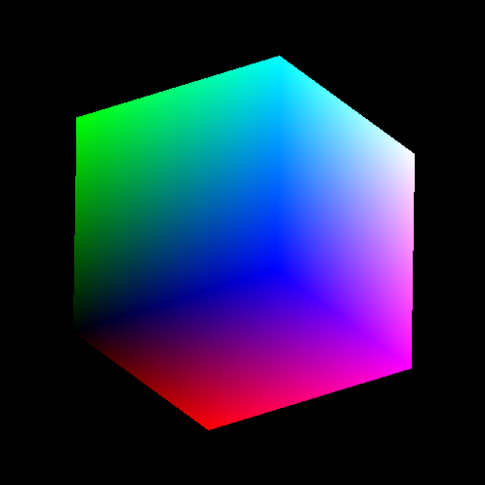

## Aim
Write a program to draw a color cube and allow the user to move the camera suitably to experiment with perspective viewing. Use OpenGL functions.

## Algorithm
1. Choose appropriate coordinates to make a cube
2. Rotate or move the cube by a small variation on user input
3. Repeat

## Code
```
#include <stdio.h>
#include <stdlib.h>

// Apple Specific Compatibility Issues
#ifdef __APPLE__
	#include "GLUT/glut.h"
#else
	#include "GL\glut.h"
#endif

GLfloat vertices[][3] = {
  {-1, -1, -1}, {1, -1, -1}, {1, 1, -1}, {-1, 1, -1},
  {-1, -1, 1}, {1, -1, 1}, {1, 1, 1}, {-1, 1, 1}
};

GLfloat normals[][3] = {
  {-1, -1, -1}, {1, -1, -1}, {1, 1, -1}, {-1, 1, -1},
  {-1, -1, 1}, {1, -1, 1}, {1, 1, 1}, {-1, 1, 1}
};

GLfloat colors[][3] = {
  {0, 0, 0}, {1, 0, 0}, {1, 1, 0}, {0, 1, 0},
  {0, 0, 1}, {1, 0, 1}, {1, 1, 1}, {0, 1, 1}
};

void polygon(int a, int b, int c, int d) {
  glBegin(GL_POLYGON);

  glColor3fv(colors[a]);
  glNormal3fv(normals[a]);
  glVertex3fv(vertices[a]);

  glColor3fv(colors[b]);
  glNormal3fv(normals[b]);
  glVertex3fv(vertices[b]);

  glColor3fv(colors[c]);
  glNormal3fv(normals[c]);
  glVertex3fv(vertices[c]);

  glColor3fv(colors[d]);
  glNormal3fv(normals[d]);
  glVertex3fv(vertices[d]);

  glEnd();
}

void colorCube() {
  polygon(0, 3, 2, 1);
  polygon(2, 3, 7, 6);
  polygon(0, 4, 7, 3);
  polygon(1, 2, 6, 5);
  polygon(4, 5, 6, 7);
  polygon(0, 1, 5, 4);
}

static GLfloat theta[] = {0, 0, 0};
static GLint axis = 2;
static GLdouble viewer[] = {0, 0, 5};

void display(void) {
  glClear(GL_COLOR_BUFFER_BIT | GL_DEPTH_BUFFER_BIT);
  glLoadIdentity();

  // Perspective Viewing Function
  gluLookAt(viewer[0], viewer[1], viewer[2], 0, 0, 0, 0, 1, 0);

  glRotatef(theta[0], 1, 0, 0);
  glRotatef(theta[1], 0, 1, 0);
  glRotatef(theta[2], 0, 0, 1);
  colorCube();

  glFlush();
  glutSwapBuffers();
}

void mouse(int btn, int state, int x, int y) {
  if (btn == GLUT_LEFT_BUTTON && state == GLUT_DOWN)
    axis = 0; // X-axis

  if (btn == GLUT_MIDDLE_BUTTON && state == GLUT_DOWN)
    axis = 1; // Y-axis

  if (btn == GLUT_RIGHT_BUTTON && state == GLUT_DOWN)
    axis = 2; // Z-axis

  theta[axis] += .5;
  if (theta[axis] > 360)
    theta[axis] = -360;

  glutPostRedisplay();
}

void keyboard(unsigned char key, int x, int y) {
  if (key == 'x')
    viewer[0] -= 1;

  if (key == 'X')
    viewer[0] += 1;

  if (key == 'y')
    viewer[1] -= 1;

  if (key == 'Y')
    viewer[1] += 1;

  if (key == 'z')
    viewer[2] -= 1;

  if (key == 'Z')
    viewer[2] += 1;

  display();
}

void glReshape(int w, int h) {
  glViewport(0, 0, w, h);
  glMatrixMode(GL_PROJECTION);
  glLoadIdentity();
  if (w <= h)
    glOrtho(-2, 2, -2 * ((GLfloat) h / (GLfloat) w), 2 * ((GLfloat) h / (GLfloat) w), -10, 10);
  else
    glOrtho(-2 * ((GLfloat) w) / ((GLfloat) h), 2 * ((GLfloat) w / (GLfloat) h), -2, 2, -10, 10);
  glMatrixMode(GL_MODELVIEW);
}

int main(int argc, char **argv) {
  glutInit(&argc, argv);
  glutInitDisplayMode(GLUT_DOUBLE | GLUT_RGB | GLUT_DEPTH);
  glutInitWindowSize(500, 500);
  glutCreateWindow("Moving Color Cube");
  glutReshapeFunc(glReshape);
  glutDisplayFunc(display);
  glutMouseFunc(mouse);
  glutKeyboardFunc(keyboard);
  glEnable(GL_DEPTH_TEST);
  glutMainLoop();
}
```

## Execution
```
g++ -framework OpenGL -framework GLUT 08_MoveCube.c -w
./a.out
```

## Output

