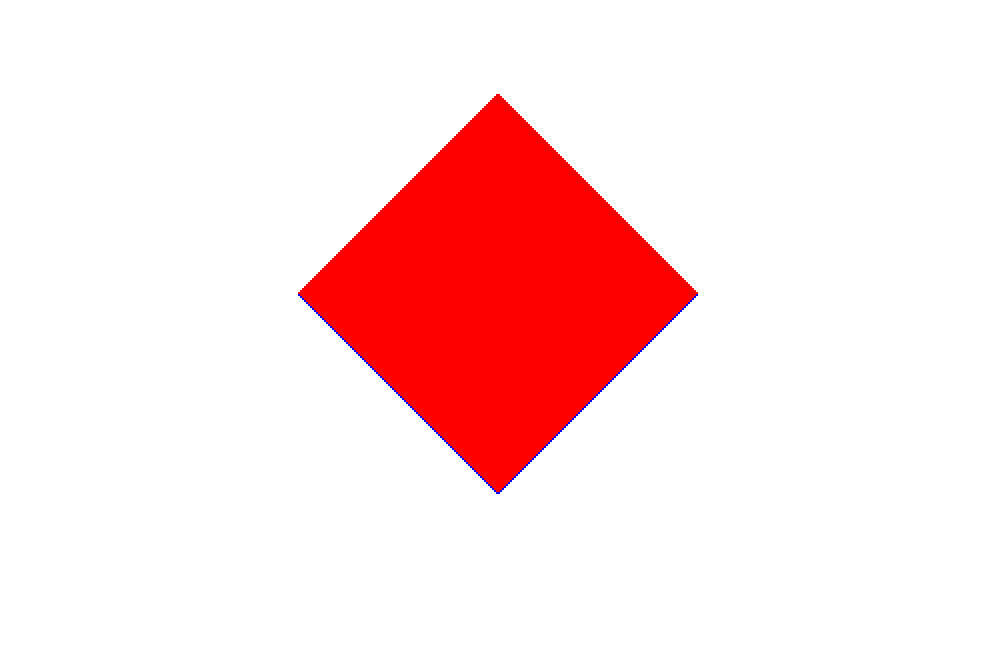

## Aim
Write a Program to fill any given polygon using scan-line area filling algorithm.

## Algorithm
For each scan line:
1. Find the intersections of the scan line with all edges of the polygon.
2. Sort the intersections by increasing x-coordinate.
3. Fill in all pixels between pairs of intersections.

## Code
```
#include <stdio.h>
#include <stdlib.h>

// Apple Specific Compatibility Issues
#ifdef __APPLE__
	#include "GLUT/glut.h"
#else
	#include "GL\glut.h"
#endif

float x1, x2, x3, x4,
      y1, y2, y3, y4;

void edgeDetect(float x1, float y1, float x2, float y2, int *le, int *re) {
  float mx, x, temp;
  int i;

  /* Since we scan top to bottom, ensure that y2 lies above y1, else swap */
  if ((y2 - y1) < 0) {
    temp = y1;
    y1 = y2;
    y2 = temp;

    temp = x1;
    x1 = x2;
    x2 = temp;
  }

  /*
   * 'mx' denotes the inverse of slope. For every change in y (dy)
   * 'mx' gives us the change in x (dx).
   * `dx = dy * mx`
   */
  if ((y2 - y1) != 0)
    mx = (x2 - x1) / (y2 - y1);
  else
    mx = x2 - x1;

  // We start from the bottom (x1) and go up.
  x = x1;

  /*
   * For y starting 'y1' to 'y2', get the left and right edges of the
   * quadrilateral and assign them to 'le' and 're' respectively.
   */
  for (i = y1; i <= y2; i++) {
    if (x < le[i])
      le[i] = x;
    if (x > re[i])
      re[i] = x;

    // A change of '1' (one) (in for loop) for 'y' causes a change of 'mx' in 'x'.
    x += mx;
  }
}

// Fill the given (x, y) co-ordinate with Red color.
void drawPixel(int x, int y) {
  glColor3f(1, 0, 0);
  glBegin(GL_POINTS);
  glVertex2i(x, y);
  glEnd();
}


// Given the points of the quadrilateral on the canvas, fill it with color.
void scanFill(float x1, float y1, float x2, float y2, float x3, float y3, float x4, float y4) {
  /*
   * `left_edge` and `right_edge` denote the whole canvas, the index
   * is up to 500 because we've set the canvas size to be 500x500
   * in gluOrtho2D().
   */
  int left_edge[500], right_edge[500];
  int i, j;

  for (i = 0; i < 500; i++) {
    left_edge[i] = 500;
    right_edge[i] = 0;
  }

  /*
   * Obtain the left and right edges of the Quadrilateral by
   * taking two points (one side) of the Quadrilateral at a
   * time.
   */
  edgeDetect(x1, y1, x2, y2, left_edge, right_edge);
  edgeDetect(x2, y2, x3, y3, left_edge, right_edge);
  edgeDetect(x3, y3, x4, y4, left_edge, right_edge);
  edgeDetect(x4, y4, x1, y1, left_edge, right_edge);

  // Go through the the canvas and color each line from left_edge to right_edge.
  for (j = 0; j < 500; j++) {
    if (left_edge[j] <= right_edge[j])
      for (i = left_edge[j]; i < right_edge[j]; i++)
        drawPixel(i, j);
  }
}

void display() {
  // Indices of the Quadrilateral.
  // Clockwise from the bottom.
  x1 = 250; y1 = 250;
  x2 = 150; y2 = 350;
  x3 = 250; y3 = 450;
  x4 = 350; y4 = 350;

  glClear(GL_COLOR_BUFFER_BIT);
  glColor3f(0, 0, 1);

  /* Draw the Quadrilateral */
  glBegin(GL_LINE_LOOP);
    glVertex2f(x1, y1);
    glVertex2f(x2, y2);
    glVertex2f(x3, y3);
    glVertex2f(x4, y4);
  glEnd();

  /* Fill the Quadrilateral */
  scanFill(x1, y1, x2, y2, x3, y3, x4, y4);

  glFlush();
}

void glInit() {
  glClearColor(1, 1, 1, 1);
  glColor3f(1, 0, 0);
  glPointSize(1);
  glMatrixMode(GL_PROJECTION);
  glLoadIdentity();
  gluOrtho2D(0, 500, 0, 500);
}

int main(int argc, char **argv) {
  glutInit(&argc, argv);
  glutInitDisplayMode(GLUT_SINGLE | GLUT_RGB);
  glutInitWindowSize(500, 500);
  glutInitWindowPosition(0, 0);
  glutCreateWindow("Filling a Polygon using Scan Fill Algorithm");
  glutDisplayFunc(display);
  glInit();
  glutMainLoop();
}
```

## Execution
```
g++ -framework OpenGL -framework GLUT 09_ScanFill.c -w
./a.out
```

## Output

